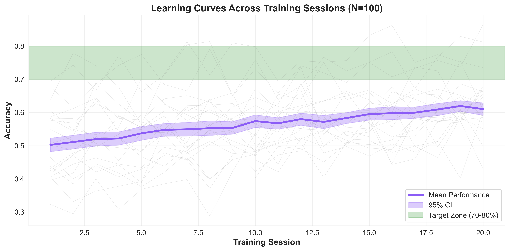

# Neuroplay

> Protótipo web gamificado para atividades lúdicas e inclusão digital, com jogos interativos, adaptação experimental de dificuldade e visualização de progresso.

[](LICENSE)

## Status

**Protótipo acadêmico em evolução.** A aplicação demonstra uma arquitetura full stack e atividades lúdicas inspiradas em tarefas cognitivas conhecidas. O Neuroplay não é dispositivo médico, não fornece diagnóstico, não promete tratamento ou melhora clínica e não substitui avaliação profissional.

## O que o projeto demonstra

O Neuroplay explora como uma aplicação web pode oferecer experiências interativas para atenção, memória de trabalho e controle inibitório. O projeto combina frontend React, renderização 3D, áudio no navegador, modelos adaptativos e uma API Python com persistência de dados.

## Funcionalidades principais

| Área | Implementação |
|---|---|
| Jogos | Mestres do Sinal, Caçador de Alvos e Memória Dupla disponíveis no protótipo; os resultados são apenas indicadores de interação. |
| Adaptação | TensorFlow.js e Scikit-learn para experimentar ajuste de dificuldade e análise de desempenho. |
| Interface | React, Three.js, Framer Motion e componentes responsivos. |
| Áudio | Web Audio API, Tone.js e Howler.js. |
| Backend | Flask, SocketIO, SQLAlchemy, PostgreSQL e Redis. |
| Operação | Docker Compose e GitHub Actions para automação do ciclo de desenvolvimento. |

## Demonstração visual



A figura acima é um artefato de análise do projeto, não uma validação clínica. Adicione screenshots ou GIFs da interface assim que a experiência pública estiver validada. Enquanto o deploy estiver em manutenção, execute o projeto localmente com Docker para reproduzir a interface.

## Execução local

### Docker

```bash
git clone https://github.com/Dev-HP/neuroplay.git
cd neuroplay
docker compose up -d
```

Depois, acesse o frontend em `http://localhost:3000`, o backend em `http://localhost:5000` e o PgAdmin em `http://localhost:5050`, quando os serviços estiverem disponíveis na configuração local.

### Execução manual

```bash
# Backend
cd backend
python -m venv .venv
source .venv/bin/activate
pip install -r requirements.txt
python app.py

# Em outro terminal, frontend
cd frontend
npm install
npm start
```

No Windows, use o comando equivalente de ativação do ambiente virtual. Consulte os arquivos em `docs/` caso a configuração local tenha requisitos adicionais.

## Arquitetura

```text
React + Three.js + TensorFlow.js
              │
              ▼
        Flask + SocketIO
              │
              ▼
 PostgreSQL + Redis + serviços analíticos
```

A arquitetura é experimental. O código deve ser avaliado com dados fictícios e sem informações pessoais ou clínicas reais.

## Referências e limites

As atividades usam ideias de tarefas como Go/No-Go, Stroop, Flanker e Dual N-Back. As referências precisam ser consultadas na documentação do projeto antes de qualquer interpretação clínica. A menção a produtos regulados ou estudos externos não significa aprovação ou validação regulatória do Neuroplay.

## Documentação

- [Arquitetura](docs/architecture/ARQUITETURA.md)
- [Posicionamento e limites](docs/PRODUCT_POSITIONING.md)
- [Painel do educador](docs/PAINEL_EDUCADOR_SPEC.md)
- [Tecnologias](docs/architecture/TECNOLOGIAS.md)
- [Instalação](docs/guides/INSTALACAO.md)
- [Deploy](docs/guides/DEPLOY.md)

## Contribuição e licença

Contribuições são bem-vindas por meio de issues e pull requests. O projeto está sob a licença [MIT](LICENSE). Não envie dados pessoais, clínicos ou identificáveis para este repositório.

## Autor

**Hélio Paulo Leite de Lima** — [GitHub](https://github.com/Dev-HP)
